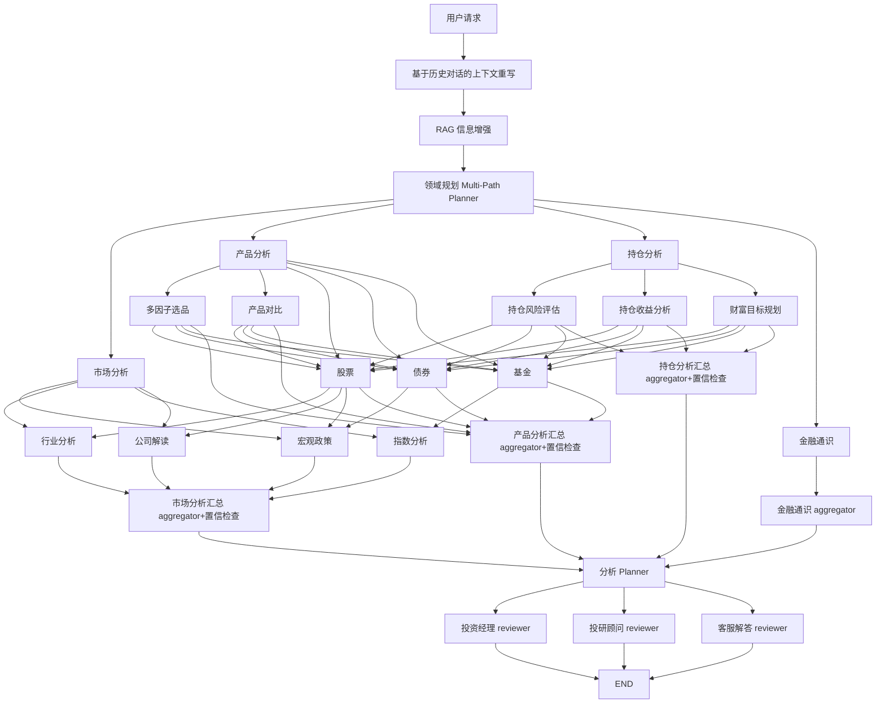

# High Level Design


## 设计要点说明
- 使用可调度版本的LangGraph（支持条件流+并行） 
除了reviewer部分之外，所有的分支都利用LangGraph的conditional edge + parallel branch构建。
    ```python
    builder.add_conditional_edges(
        "planner",
        lambda state: state["selected_domains"],
        {
            "market": "market",
            "product": "product",
            ...
        }
    )
    ```

- 节点之间的依赖以state显式管理  
    例如：
    - 股票 → 行业分析，是 依赖关系（传递行业代码）
    - 多因子选品 → 股票，是 任务触发
   ```python 
    state = {
        "stock_tickers": ["600519"],
        "industry_code": "B12",
    ...
    }
    ```

- aggregator 节点应具备“中间解释能力”
每个 aggregator：
    - 输出一个“子结论”
    - 记录数据来源与置信度
    - 标记是否存在冲突（如宏观建议看多 vs 技术看空）
    ```json
    {
        "domain": "市场分析",
        "summary": "宏观环境支持反弹，行业强势",
        "confidence": 0.85,
        "conflicts": ["公司财务不佳"]
    }
    ```
- reviewers具备角色差异化目标（提示词结构和风格不同）

    | Reviewer | 职能目标           |
    | -------- | -------------- |
    | 投资经理     | 战略建议 + 实盘调仓建议  |
    | 投研顾问     | 投资逻辑、底层研究      |
    | 客服解答     | 面向客户解释 + 普通话术化 |

- 多轮规划能力
    - 对涉及投资相关问题，在用户初始问题后自动问回问题（clarify intent）
    - 规划阶段进行确认（是否要结合持仓）
    - 领域规划planner 后让用户选择继续“投资建议”、“调仓计划”等
    ```mermaid
    graph TD
        planner[领域规划Planner]
        planner --> next_decision{是否继续？}
        next_decision --> 调仓助手Agent
        next_decision --> 结束END
    ```

### 代码整合实现
 TODO：FinancialAnalyzeFundAgent

### 数据库
数据库连接：118.25.6.157
数据库名：jydb
用户名：root
密码：2wsx!QAZ

### RAG设计