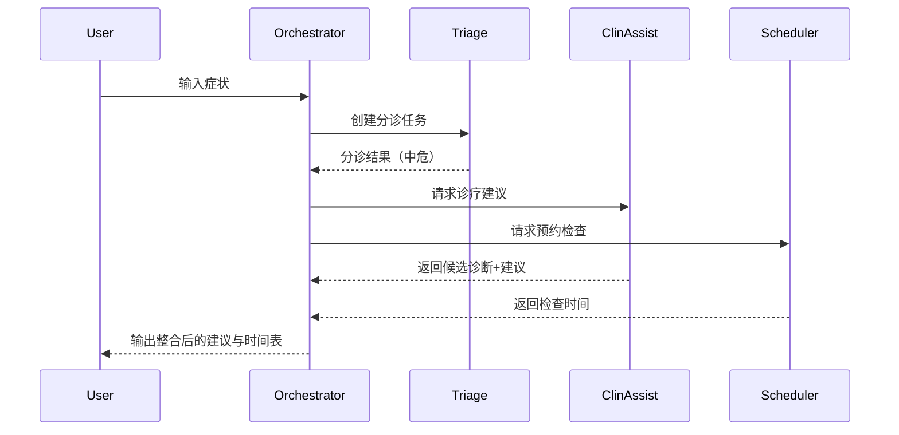
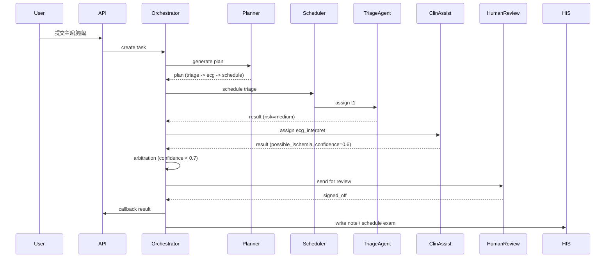

# 智慧医疗 AI Agent 设计方案

## Orchestration Agent（编排代理）详细设计

### 1. 职责定位

- **任务分解与规划**：解析来自用户或系统的高层请求，将其拆分为可执行的子任务。
- **多 Agent 路由与调度**：根据任务类型、优先级、依赖关系，将任务分配给合适的专业 Agent（如 Triage、ClinAssist、Scheduler 等）。
- **状态追踪与任务协调**：维护全局任务状态机，处理任务超时、失败重试与补偿。
- **冲突仲裁与结果整合**：对多 Agent 产生的结果进行冲突检测、合并或人工复核。
- **会话与上下文管理**：跨多轮交互保持上下文一致性，调取长期记忆与相关知识。

### 2. 架构与组件

1. **输入解析器（Intent Parser）**
   - 使用 NLU 模型解析用户输入或事件消息，识别意图、实体、上下文。
2. **任务规划器（Task Planner）**
   - 基于 Plan-and-Execute 或 ReAct 策略生成任务树/任务链。
3. **调度器（Task Dispatcher）**
   - 管理任务队列，按优先级、可用资源、依赖顺序分配任务。
4. **消息总线接口（Message Bus Adapter）**
   - 与 Kafka/NATS 等消息中间件对接，实现事件驱动或发布-订阅模式。
5. **结果汇聚器（Result Aggregator）**
   - 汇总多个 Agent 的输出，进行冲突检测、仲裁和格式化。
6. **日志与审计模块（Audit Logger）**
   - 全链路记录任务上下文、Agent 调用、输入输出、人工干预。

### 3. 协同协议与任务Schema（示例）

```json
{
  "task_id": "uuid",
  "patient_id": "hashed_id",
  "initiator": "triage_agent | user | system",
  "intent": "schedule_exam | get_diagnosis | monitor_alert",
  "input": {
    "symptoms": ["chest pain"],
    "vitals": {"hr": 110, "bp": "150/90"}
  },
  "dependencies": ["task_uuid_1"],
  "priority": "high | medium | low",
  "expected_output": "structured JSON / report / alert",
  "ttl": 3000,
  "audit_meta": {
    "created_at": "timestamp",
    "created_by": "agent_id | user_id"
  }
}
```

### 4. 工作流程（Mermaid 序列图示例）



### 5. 异常与补偿机制

- **超时处理**：子任务超时则返回部分结果并标记人工介入。
- **回滚策略**：如果后续任务失败（如预约失败），撤销相关资源占用并通知用户/医护。
- **优雅降级**：关键 Agent 不可用时，调用备用模型或简化流程。

### 6. 安全与合规

- 所有任务在调度前通过 PrivacyGuard 检查。
- 对敏感操作（如用药、手术）强制 Human-in-the-loop。
- 保留任务执行链条的可追溯性。

### 7. 性能优化

- 支持并行调度独立子任务。
- 基于历史执行数据优化任务路由（Agent 成功率、延迟统计）。
- 在高负载时优先处理高危和急诊任务。


# Orchestration Agent 详细设计

> 本节为 Orchestration Agent（编排代理）的工程化细化，覆盖角色定位、组件分解、Task/Message Schema、API 合同、调度算法、错误/回滚策略、审计/合规、可观测性与部署建议，重点面向多智能体协同场景。

---

## 1. 目标与定位

- **中心职责**：作为多 Agent 协作的控制平面，负责任务接收、任务分解（Planning）、任务调度与分发（Dispatching）、跨 Agent 的状态跟踪、结果聚合与决策仲裁（Arbitration），并保证审计、权限、可回溯性。
- **设计原则**：可解释、可复现、可审计（audit-first）；松耦合（通过消息总线），高可靠（持久化任务状态、补偿机制），低侵入（不直接越权执行危险操作）。

## 2. 组件分解

- **API Gateway / Ingress**：接收外部请求，做基础鉴权、限流、速率控制。
- **Validator & AuthZ**：输入验证、RBAC/ABAC 权限校验、隐私级别确认（是否允许访问敏感记录）。
- **Task Store（持久层）**：持久化任务与状态（Postgres/Timescale/ DynamoDB），用于审计与恢复。短期状态缓存可使用 Redis。
- **Planner**：将高阶请求拆解为子任务（可使用规则引擎 + LLM 混合），产出 DAG/Plan。
- **Scheduler/Dispatcher**：基于 Agent 注册表、能力匹配、优先级与资源约束分配子任务，调用消息总线/直连 Agent 接口。
- **Agent Registry & Heartbeat**：维护 Agent 能力描述、健康/负载信息、版本与许可。支持动态注册/注销。
- **Arbiter / Policy Engine**：聚合多 Agent 返回，执行仲裁策略（置信度加权、规则优先、human-in-loop）。
- **Compensation / Saga Manager**：在跨 Agent 的多步骤任务失败时执行补偿逻辑。
- **Audit & Explainability Store**：记录 prompt、检索证据、决策理由、人工复核动作与时间戳。
- **Metrics & Tracing**：OpenTelemetry、Prometheus、Grafana，用于告警与性能分析。

## 3. Task Schema（标准化消息契约）

```json
{
  "task_id": "string",                
  "parent_task_id": "string|null",
  "correlation_id": "string",       
  "patient_id": "string|null",
  "origin": {"user_id":"string","source":"app|hie|api"},
  "task_type": "string",             
  "priority": "int",                
  "ttl_seconds": "int",
  "payload": { },                      
  "expected_outputs": ["string"],    
  "assign_policy": {                   
     "mode": "auto|manual",
     "preferences": { }
  },
  "status": "PENDING|RUNNING|WAITING|FAILED|SUCCEEDED|CANCELLED",
  "attempts": 0,
  "created_at": "RFC3339",
  "updated_at": "RFC3339",
  "metadata": { },
  "audit": [ {"ts":"RFC3339","actor":"orchestrator|agent|user","action":"created|assigned|completed|error","detail":{}} ]
}
```

### 字段说明

- `task_type`：例如 `triage`, `clin_assist:diagnose`, `schedule:appointment`, `monitor:alarm`。
- `priority`：整数，范围 [0..100]，越大优先级越高。
- `ttl_seconds`：任务最大生命周期，超时需进入失败/补偿流程。
- `assign_policy.mode`：`auto` 表示 Orchestrator 自动分配；`manual` 表示发送到人工复核队列。

## 4. Agent 描述（Agent Descriptor）

```json
{
  "agent_id":"string",
  "capabilities":["triage","image:interpret","lab:interpret"],
  "concurrency": 4,
  "load": 0.3,
  "latency_ms_estimate": 120,
  "version":"v1.2.0",
  "trusted": true,
  "allowed_actions": ["read_emr","write_note"]
}
```

## 5. API 合同（REST 示例）

- `POST /api/v1/tasks` — 创建任务（返回 task\_id）
- `GET /api/v1/tasks/{task_id}` — 查询任务状态与审计记录
- `POST /api/v1/tasks/{task_id}/cancel` — 取消任务
- `POST /api/v1/agents/register` — Agent 注册（或心跳）
- `POST /api/v1/agents/{agent_id}/heartbeat` — 更新负载/状态
- `POST /api/v1/tasks/{task_id}/callback` — Orchestrator 向上游回调（或 Agent 发送结果）

示例创建任务 Request Body：

```json
{
  "task_type":"triage",
  "patient_id":"P12345",
  "priority": 80,
  "ttl_seconds": 300,
  "payload": {"symptoms":"胸痛, 呼吸困难", "vitals":{"hr":110}}
}
```

## 6. 事件流与消息总线（Kafka / NATS / Pub/Sub）

**Topic/Channel**：`tasks.created`, `tasks.assigned`, `tasks.updated`, `tasks.result`, `agents.status`, `orchestrator.audit`

事件示例（tasks.assigned）：

```json
{
  "task_id":"T-xxx",
  "agent_id":"triage-01",
  "assigned_at":"2025-08-08T10:00:00Z",
  "deadline":"2025-08-08T10:05:00Z"
}
```

## 7. 任务生命周期（同步/异步）

1. **接收**：API 接收请求 -> Validator -> AuthZ -> 写入 Task Store（PENDING）。
2. **计划**：Planner 读取请求与上下文（EMR、历史），生成子任务 Plan（DAG）。
3. **调度**：Scheduler 根据 Agent registry 与策略分配子任务（发布 `tasks.assigned`）。
4. **执行与监控**：等待 Agent 返回（或订阅 `tasks.result`），支持 partial result 与流式输出。
5. **聚合**：Arbiter 汇总子任务输出，执行一致性校验、证据拼接、置信度计算。
6. **仲裁/复核**：若满足自动化规则直接返回；若命中人工复核规则，转入人工队列并通知医生。
7. **完成/补偿**：正常完成则标 `SUCCEEDED` 并回调上游；若失败执行补偿任务（通过 Saga Manager）。

## 8. Planner（任务分解）策略

- **规则引擎优先**：对常见、确定性的场景使用规则（如 chest\_pain 的红色标识路由到急诊），降低 LLM 调用量与不可预测性。
- **LLM 增强**：当规则不足以覆盖自然语言的复杂性时，调用 LLM 进行意图解析与基于上下文的子任务拆分。
- **约束求解器**：用于资源排期（Scheduler）-- 输入资源矩阵（器械/床位/医生名单/时间窗）求解满足优先级的排期。

示例 Planner 输出（Plan）：

```json
{
  "plan_id":"plan-001",
  "tasks":[
    {"id":"t1","type":"triage","deps":[]},
    {"id":"t2","type":"clin_assist:ecg_interpret","deps":["t1"]},
    {"id":"t3","type":"schedule:ecg","deps":["t1"]}
  ]
}
```

## 9. 调度/分配算法（示例）

- **匹配规则**：capability ∩ task.required\_capabilities 非空。
- **评分函数（score）**：
  - `score = w_cap*capability_match + w_load*(1 - normalized_load) + w_prio*normalized_priority - w_lat*normalized_latency`
  - 归一化后选最大 score。阈值低于 `min_score` 则进入人工或回退策略。
- **亲和/隔离策略**：为同一 patient 同一会话优先分配同 agent（若 agent 支持），以便上下文连续性。
- **预留槽**：对高优先级紧急任务保留若干并发位，避免长任务饱和系统。

## 10. 仲裁（Aggregation & Arbitration）

- **合并策略**：若多个 agent 返回诊断结果，使用置信度加权融合（weighted voting）。
- **规则优先**：若权威知识库（指南）与结果冲突，优先触发人工复核。
- **不确定度上报**：输出需包含 `confidence` 与 `evidence` 列表，并给出 `explainability`（决策链路）。
- **举手规则（Human-in-the-loop）**：当 `confidence < threshold` 或命中高风险类型（手术、院级变更、用药警示）自动转人工审核队列。

## 11. 事务性与补偿（Saga 模式）

- 对跨 Agent 的多步工作流使用**长事务 + 补偿**：每个子任务需登记补偿动作（例如：已预约则需在补偿时取消预约）。
- 所有对外侧系统的操作必须是**幂等**且带有 `operation_id`，以防止重复执行造成副作用。

## 12. 错误处理与重试策略

- **短暂性错误**：指数退避（backoff）+ 最大重试次数（例如 3 次），记录尝试次数。
- **永久性错误**：直接标记 `FAILED`，并触发人工告警与问题工单。
- **超时处理**：任务超过 `ttl_seconds` 进入 `FAILED`，并发起补偿链或人工干预。
- **Circuit Breaker**：对异常率较高的 Agent 暂时隔离并降级到备选 Agent。

## 13. 审计与可解释性

- 必须保存以下审计项：`task_id, prompt/inputs, retrieved_evidence_ids, agent_id, outputs, confidence, timestamps, human_overrides`。
- 审计数据分级存储：敏感审计（包含 PHI）存入受限审计库并限制查询权限；普通审计可用于行为分析。
- 支持按 `task_id` 回放完整事件流（用于法务/质量复查）。

## 14. 可观测性与指标

- **关键指标**：任务处理延迟 P50/P95/P99、任务成功率、平均重试次数、每种 task\_type 的人工介入率、Agent 健康率、队列长度。
- **日志追踪**：每个 Task 产出 Trace（包含 Planner、Dispatcher、每个 Agent 调用与返回）。
- **告警**：队列积压、任务失败率异常、重要 Agent 健康下降。

## 15. 安全与合规

- **认证**：API 使用 mTLS + JWT（短期 token）。Agent 注册仅允许通过签名证书。
- **授权**：基于任务的敏感级别实施 ABAC（Attribute-Based Access Control）。
- **最小化日志暴露**：日志/监控中脱敏敏感字段；仅审计库保存可检索的 PHI 并受限访问。

## 16. 测试与验证

- **合成数据集**：用于端到端测试（保证不泄露真实 PHI）。
- **故障注入**：模拟 Agent 离线、消息丢失、数据库不可用等场景进行鲁棒性测试。
- **安全测试**：Prompt injection、越权请求、审计回放测试。

## 17. 部署/扩缩容建议

- **无状态组件**（API、Dispatcher、Planner）部署成 Kubernetes Deployment，结合 HPA（基于 CPU/队列长度）扩缩容。
- **状态组件**（Task Store、Audit DB）采用主从/受管服务并做定期备份。
- **消息总线分区**：按 tenant/hospital 或 task\_type 分区，以减少跨租户影响。

## 18. 典型序列图（Mermaid）



## 19. 示例：Orchestrator 核心伪代码（Python 风格）

```python
async def orchestrator_worker(event):
    task = validate_and_persist(event)
    plan = planner.plan(task)
    persist_plan(plan)
    for sub in plan.tasks:
        candidate_agents = registry.find_agents(sub.required_capabilities)
        agent = scheduler.select(candidate_agents, policy=task.assign_policy)
        dispatch(sub, agent)
    results = await gather_results(plan, timeout=task.ttl_seconds)
    aggregated = arbiter.aggregate(results)
    if aggregated.confidence < CONF_THRESHOLD or aggregated.risk=="high":
        route_to_human(aggregated)
    else:
        finalize_and_callback(aggregated)
```

## 20. 开放设计点与建议优先级

1. **定义自动化边界表**：哪些 task\_type 可以 100% 自动化？哪些必须人工确认？（优先级：高）
2. **Planner 实现策略**：先行规则引擎+后置 LLM（优先级：高）
3. **审计 / 回放能力**：从一开始就设计可回放的链路（优先级：高）
4. **高可用消息总线与分区方案**（优先级：中）
5. **补偿动作标准化与测试套件**（优先级：中）

---

如果你希望，我可以：

- 将上面的 Task Schema 导出为 **OpenAPI / JSON Schema** 或 **Protobuf**。
- 把 Planner/Dispatcher 的评分函数和策略实现成可运行的 **Python 代码片段**（含单元测试示例）。
- 把上面的 Mermaid 序列图扩展为 **更多用例**（例如：慢性随访、影像会诊、手术排程）。

告诉我你想要哪一种（OpenAPI / Protobuf / 运行代码 / 更多序列图），我直接把对应内容补进画布或生成代码文件。

