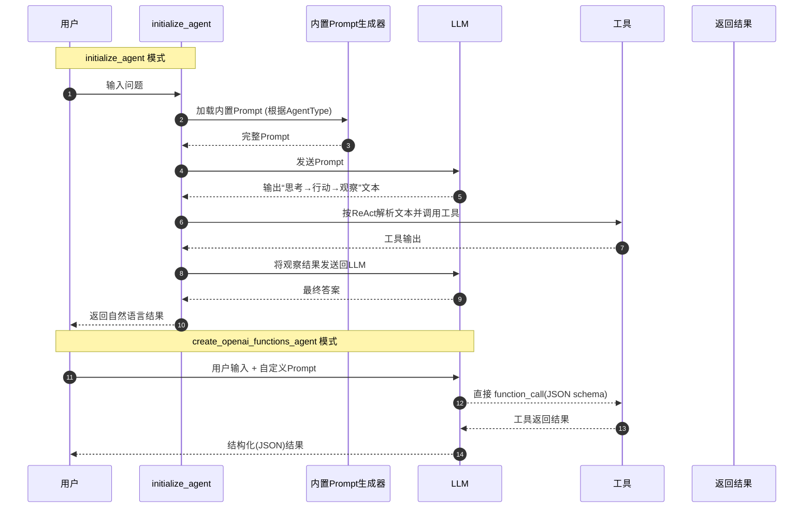

```mermaid
sequenceDiagram
    autonumber
    participant U as 用户
    participant A1 as initialize_agent
    participant P1 as 内置Prompt生成器
    participant L1 as LLM
    participant T as 工具
    participant R as 返回结果

    %% initialize_agent 流程
    Note over U,A1: initialize_agent 模式
    U->>A1: 输入问题
    A1->>P1: 加载内置Prompt (根据AgentType)
    P1-->>A1: 完整Prompt
    A1->>L1: 发送Prompt
    L1-->>A1: 输出“思考→行动→观察”文本
    A1->>T: 按ReAct解析文本并调用工具
    T-->>A1: 工具输出
    A1->>L1: 将观察结果发送回LLM
    L1-->>A1: 最终答案
    A1-->>U: 返回自然语言结果


    %% create_openai_functions_agent 流程
    Note over U,L1: create_openai_functions_agent 模式
    U->>L1: 用户输入 + 自定义Prompt
    L1-->>T: 直接 function_call(JSON schema)
    T-->>L1: 工具返回结果
    L1-->>U: 结构化(JSON)结果
```